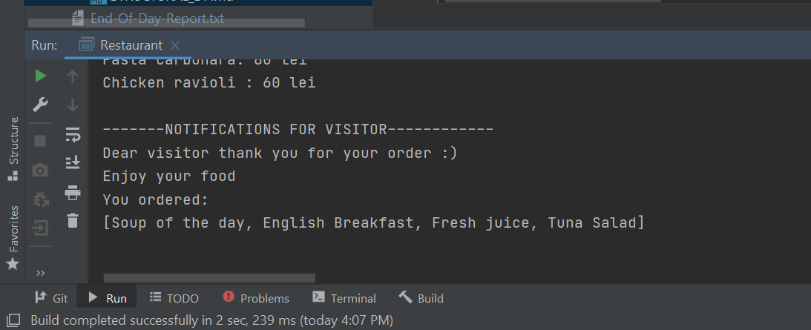

# Topic: Behavioral Design Patterns
Author: Gherbovei Ecaterina
##  Objectives:
 1. Study and understand the Behavioral Design Patterns;
 2. As a continuation of the previous laboratory work, think about what communication between software entities might be involed in your system;
 3. Implement some additional functionalities using behavioral design patterns;

## Theory:
In software engineering, behavioral design patterns are design patterns that identify common communication patterns among objects. By doing so, these patterns increase flexibility in carrying out communication.
Examples of this type of design pattern include:

 * Blackboard design pattern: provides a computational framework for the design and implementation of systems that integrate large and diverse specialized modules, and implement complex, non-deterministic control strategies
 * Chain of responsibility pattern: Command objects are handled or passed on to other objects by logic-containing processing objects
 * Command pattern: Command objects encapsulate an action and its parameters
"Externalize the stack": Turn a recursive function into an iterative one that uses a stack
 * Interpreter pattern: Implement a specialized computer language to rapidly solve a specific set of problems
 * Iterator pattern: Iterators are used to access the elements of an aggregate object sequentially without exposing its underlying representation
 * Mediator pattern: Provides a unified interface to a set of interfaces in a subsystem
 * Memento pattern: Provides the ability to restore an object to its previous state (rollback)
 * Null object pattern: Designed to act as a default value of an object
 * Observer pattern: a.k.a. Publish/Subscribe or Event Listener. Objects register to observe an event that may be raised by another object
 * Weak reference pattern: De-couple an observer from an observable
 * Protocol stack: Communications are handled by multiple layers, which form an encapsulation hierarchy
 * Scheduled-task pattern: A task is scheduled to be performed at a particular interval or clock time (used in real-time computing)
 * Single-serving visitor pattern: Optimise the implementation of a visitor that is allocated, used only once, and then deleted
 * Specification pattern: Recombinable business logic in a boolean fashion
 * State pattern: A clean way for an object to partially change its type at runtime
 * Strategy pattern: Algorithms can be selected on the fly, using composition
 * Template method pattern: Describes the program skeleton of a program; algorithms can be selected on the fly, using inheritance
 * Visitor pattern: A way to separate an algorithm from an object

## Implementation:
For this laboratory work I decided to implement iterator design pattern in order to
display notifications for visitors and to be understandable for them, and easier for
me to a structured code and do not print notifications manually every time for different clients.
So, all the code for notifications and iterator pattern I placed in a new package ```notification```.
To structure the notifications I put them in an array of notifications, and to easier operate with this array I implemented
the principle of iterator. To implement it I created an interface ```Iterator``` with 2 methods that verify if the next element
exists and another one returns the next element:
```Java
public interface Iterator {
    //verify if next element exists
    boolean hasNext();

    // returns the next element
    Object next();
}
```
Also, I implemented a concrete iterator that is NotificationIterator class
that get the notifications array, parse it and obtain every element.
And finally I have a class ```NotificationPrinter``` that uses ```Iterator``` methods and print every
notification from ```NotificationCollection```. In the main class ```Restaurant``` I simply create new
NotificationCollection and print it using NotificationPrinter.

## Screenshots, results:
 
